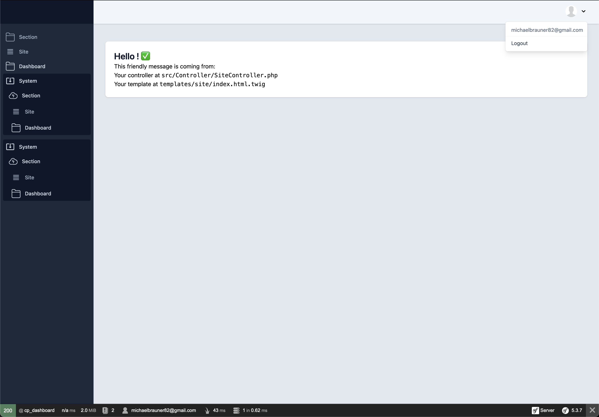

# RockBundle

This is the core package of the rock.systems ecosystem. 

## Installation

`composer require braunstetter/rock-bundle`

## What is bundled?

This bundle contains:

- control panel
- extensible user menu
- styled side navigation with extensible menu

## Control panel

This dashboard is the base for your projects: 

As you can see there is a sidebar - a clear structure and a user menu in the right corner. 
It's pretty - it's modern - it's responsive - it's pure [Twig](https://twig.symfony.com/) witch [Stimulus](https://stimulus.hotwired.dev/). 
EVERYTHING is extensible and interchangeable.

### User system - Security
> A security / user system is **NOT** included. 

The [symfony security system](https://symfony.com/doc/current/security.html) is extremely powerful and flexible. 

Instead of inventing another user system or even specifying one, which would then be difficult to adapt for special requirements, we believe it is much better if every Symfony installation, whatever software system is used, build its own user system.

Apart from that, it is now pretty easy to set up a standard user system with Symfony. (With `php bin/console make:auth` [MakerBundle](https://symfony.com/bundles/SymfonyMakerBundle/current/index.html#usage) ) this can be done in a few simple steps inside the terminal.

The philosophy behind it is - to provide you with the full power of symfony whenever possible.
